# A Joint Imitation-Reinforcement Learning Framework for Reduced Baseline Regret

Official Repository for "A Joint Imitation-Reinforcement Learning (JIRL) Framework for Reduced Baseline Regret"

## Technical Report

The report contains a detailed description of the experimental settings and hyperparameters used to obtain the results reported in our paper.

<object data="report/jirl-technical-report.pdf" type="application/pdf" width="750px" height="750px">
    <embed src="report/jirl-technical-report.pdf" type="application/pdf"></embed>
</object>

## Objectives
1. Leveraging a baseline’s online demonstrations to minimize the regret w.r.t the baseline policy during training
2. Eventually surpassing the baseline performance

## Assumptions
1. Access to a baseline policy at every time step
2. Uses an off-policy RL algorithm

## Framework

  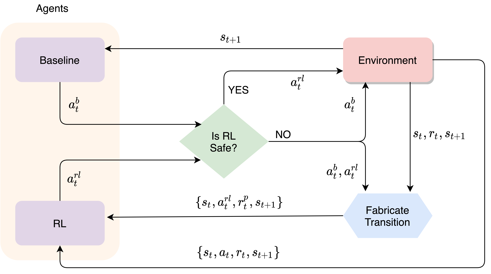

## Experiment Domains

  

    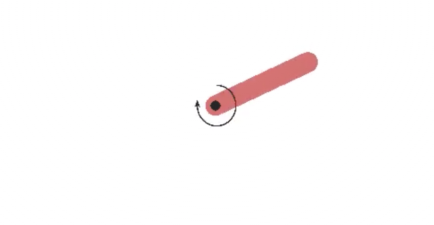
    
Inverted pendulum

  

  

    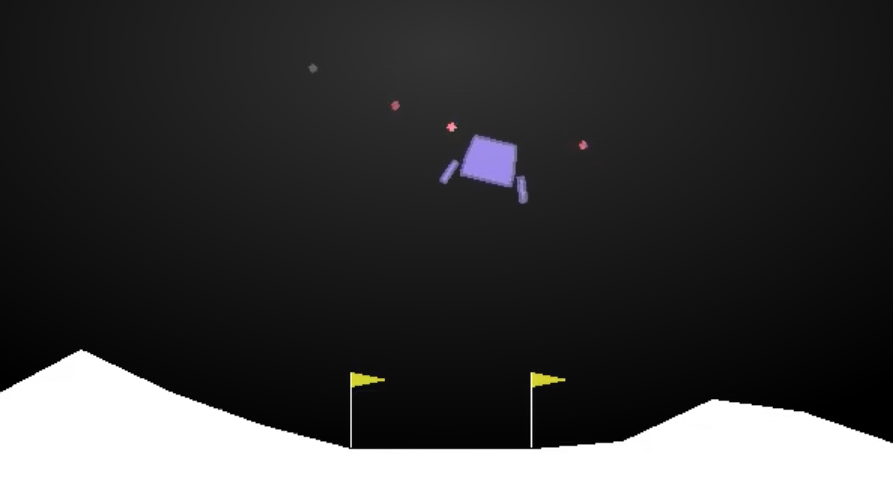
    
Lunar lander

  

  

    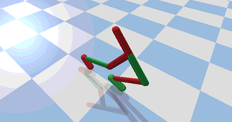
    
Walker-2D

  

  

    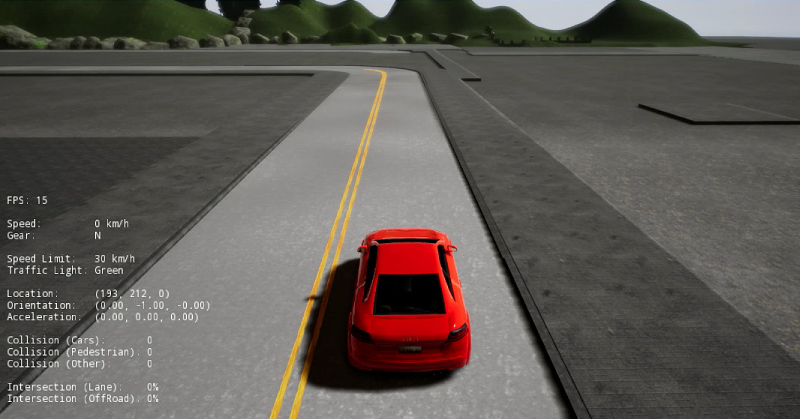
    
Lane following (CARLA)

  

  

    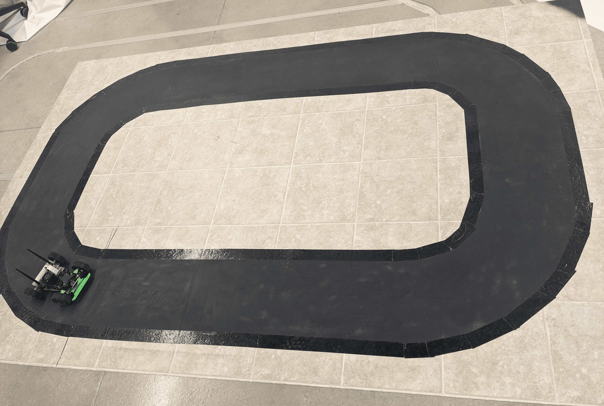
    
Lane following (JetRacer)

  

## Results
### Performance

  

    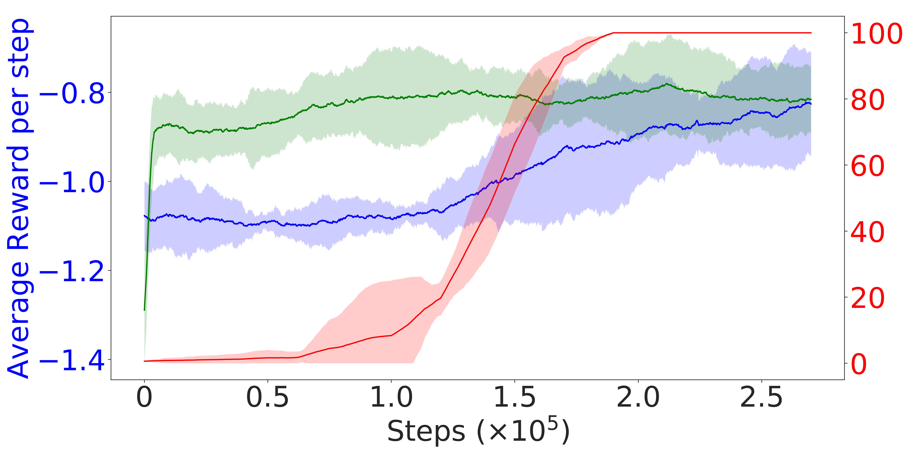
    
Inverted pendulum

  

  

    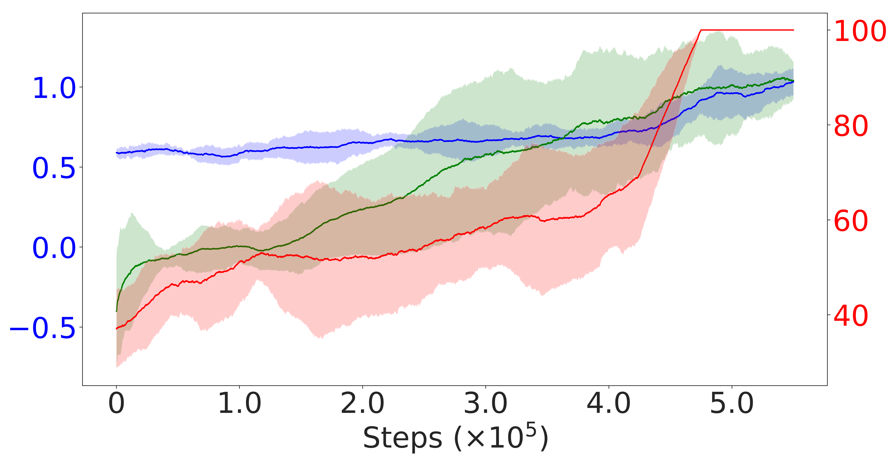
    
Lunar lander

  

  

    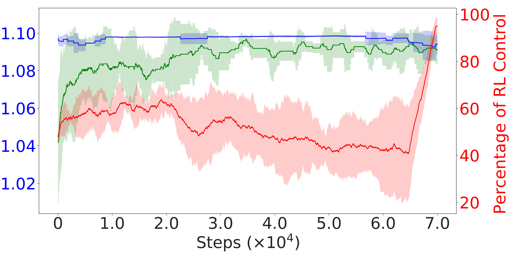
    
Lane following (CARLA)

  

  

    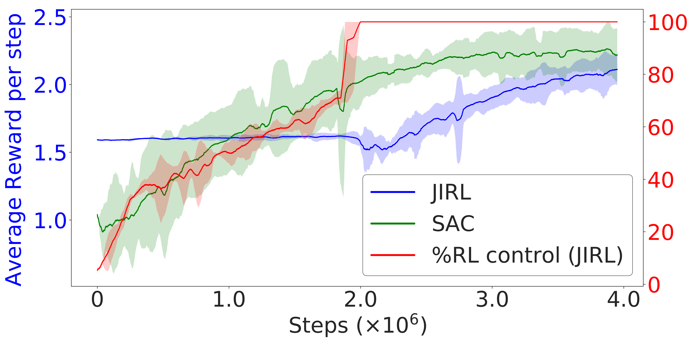
    
Walker-2D

  

  

    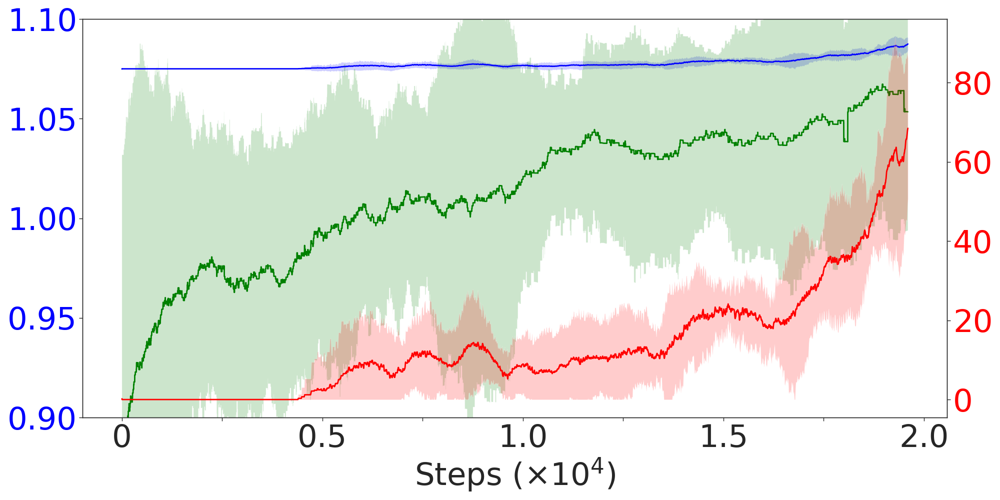
    
Lane following (JetRacer)

  

### Baseline Regret

  

    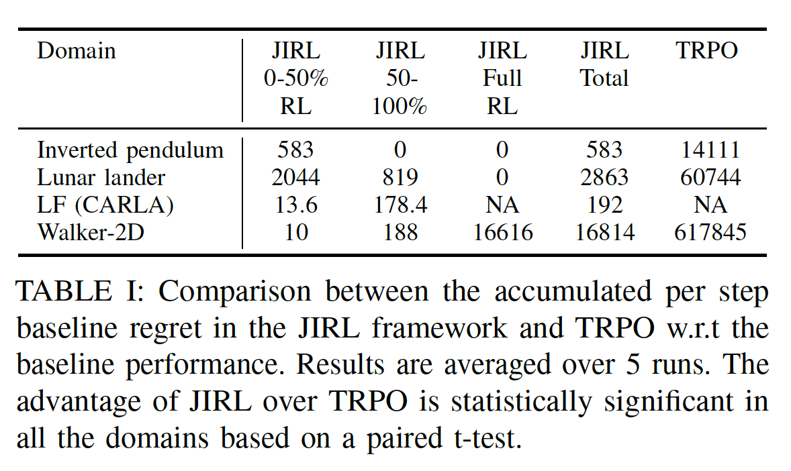
  

  

    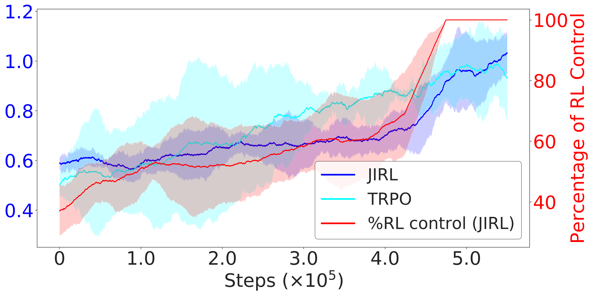
    
Lunar lander (JIRL vs TRPO)

  

